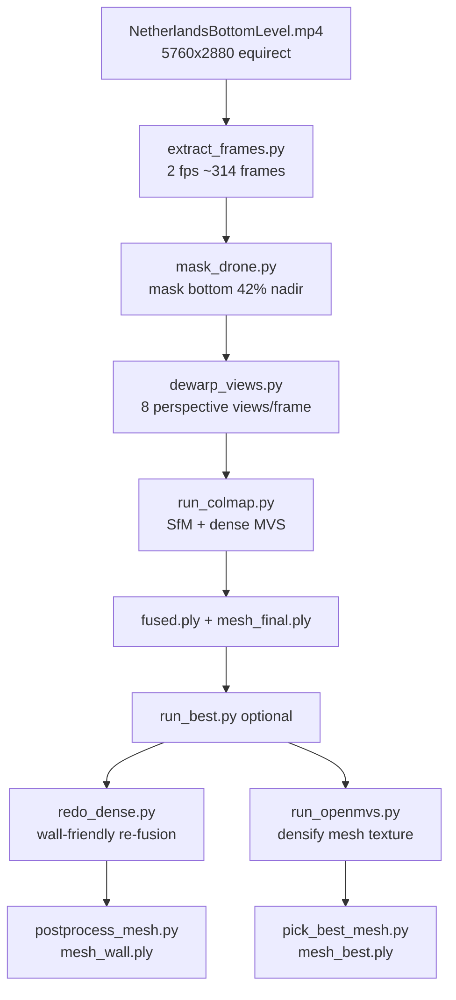

# Pipeline Architecture

## High-level flow



## Tool responsibilities

| Tool | Role |
|------|------|
| **ffmpeg** | Frame extraction from video |
| **OpenCV / Pillow** | Drone mask polygons on equirect frames |
| **Custom dewarp** | Equirect → perspective pinhole views for COLMAP |
| **COLMAP 3.13 CUDA** | Feature extract, match, mapper, patch_match_stereo, fusion, Poisson |
| **PyMeshLab** | Outlier removal, Screened Poisson, component cleanup |
| **OpenMVS 2.4** | Alternative densify, Delaunay mesh, texture atlas |
| **pick_best_mesh** | Score candidates by bbox × √faces |

## COLMAP dense path

```
images/ + masks/ + sparse/
    → image_undistorter
    → patch_match_stereo (CUDA)
    → stereo_fusion → fused.ply
    → poisson_mesher → meshed-poisson.ply
    → postprocess_mesh.py → mesh_final.ply
```

## OpenMVS path (from COLMAP dense workspace)

```
dense/ (images, sparse, cameras)
    → InterfaceCOLMAP → scene.mvs
    → DensifyPointCloud → scene_dense.mvs + scene_dense.ply
    → ReconstructMesh → scene_mesh.ply  (no new .mvs in v2.4!)
    → TextureMesh -i scene_dense.mvs -m scene_mesh.ply → scene_refine.obj
```

**Critical OpenMVS 2.4 quirk:** `ReconstructMesh` writes only a `.ply` mesh file. Camera data stays in `scene_dense.mvs`. Downstream steps must use `-i scene_dense.mvs -m scene_mesh.ply`, not a non-existent `scene_mesh.mvs`.

## Mask semantics

COLMAP masks: **0 = ignore**, **255 = valid**.

The drone polygon covers the bottom of the equirect frame (y ≥ 0.58). Scene above the line is white (valid); drone/hands region is black (ignored).

## Sparse model selection

COLMAP mapper may output `sparse/0`, `sparse/1`, etc. `pick_best_sparse_model()` in `run_colmap.py` runs `model_analyzer` on each and picks the folder with the most registered images.

## Config layering

| Config | Purpose |
|--------|---------|
| `config_netherlands_handoff.yaml` | Full 8-view extraction, baseline COLMAP |
| `config_netherlands_best.yaml` | OpenMVS + wall re-fusion + postprocess tuning |
| `config_netherlands_pro.yaml` | Keyframe selection, 4 views |
| `config_netherlands_pro1view.yaml` | Keyframe selection, 1 view |

`run_best.py` merges handoff + best configs for re-fusion parameters.
